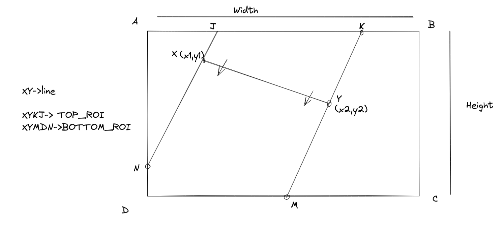
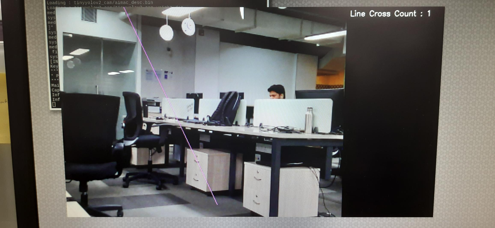

# RZV2L AI Library - Line crossing object counting

## Introduction
Line crossing object counting is a sample application that demonstrates counting of the objects when they cross a virtual line drawn by the user.
Application uses a deep learning based object detector tinyYoloV2 to detect the objects and a centroid based tracker to track the objects. 

sample video on YouTube -[Line crossing object counting demo](https://youtu.be/-fZypjgsBYo)

## Application details

### Sample Application Workflow

The application has 4 threads as described below:
- **Main thread** -> initializing all the parameters data, drawing bounding boxes around the detected object,running the tracker and sending data to display (wayland).
- **Inference thread** -> setting of paramters related to DRP-AI, inferencing from the deep learning model and assigning the results from the model to a variable.
- **Camera thread** -> reading the frame from the camera device, storing the frame into the buffer,later passed to the inference thread.
- **Termination thread** -> This thread waits for the user to press 'enter key' in the terminal, once pressed, it will join to the main thread and main thread will terminate the other thread to stop the program execution.

This pictorial representation describes these 4 threads in detail:

     |
     |  Main Thread
     |
     |---------------|----------------|---------------|--------------------|
     | Main Thread   |Inference thread| Camera thread | Termination Thread |
     |               |                |               |                    |
     |               |                |               |                    |
     |               |                |               |                    |
     |               |                |               |                    |
     |               |                |               |                    |
     |               |                |               |     Enter Key      |
     |---------------|----------------|---------------|--------------------|
     | Main Thread
     | application terminated

### Image pipeline
The overall flow of the application can be described in following sequence :
1. Image is captured from the camera device and is stored into the buffer from the 'camera thread'.
2. The content in the buffer is processed by 'Inference thread'. This involves preprocessing, inference by the deep learning model (the DRP-AI model) and post processing specfic to the model.
3. Detections are then diplayed on the monitor. Existing detections are used by the object tracking algorithm to track the object. Tracker algorithm assigns a unique identification number (ID) to an object.
4. Movement of the object in one direction is ensured by the tracker. Unique IDs are mapped to the actual count of the object. 
5. This object count, along with the detection bounding boxes is displayed on the monitor.

###  Deep learning model details

**<ins>TinyYoloV2</ins>** :- TinyYoloV2 is a state of the art neural network model. It belongs to well known Yolo family of object detectors. It requires less parameters to get  trained properly. official link : [ Official Yolo website](https://pjreddie.com/darknet/yolov2/) 

#### <ins>Working of centroid tracker</ins>
**<ins>Centroid Based Tracker</ins>** :- Centroid based tracker generates a unique ID for each detected object based on centroid detection. It tracks the detected objects as they move around in a video while maintaining the assigned ID for preselected frame numbers.

1. Centroids are calculated based on the x and y coordinates of detected bounding boxes.
2. Euclidean distance between the centroid/s of all the detected objects is calculated in current frame and previous frames.
3. If the distance between the centroid of current frame and previous frame is less than a predefined threshold, it is considerd as the same object in motion. Hence, the same existing object Id is used.
4. If the distance between the centroid of current frame and previous frame exceeds the threshold, a new object id is added.
5. When objects detected in the previous frame can not be matched to any existing objects, the object id from tracking is removed.
6. If the object wasn't detected in previous 'n' number of frames, the object id from tracking is removed.

#### <ins>How line crossing/counting works</ins>

- User gives the co-ordinates to draw the line (x1,y1),(x2,y2) and flow of direction(0/1). ( 0 means left to right, 1 means right to left).
- This line creates two virtual region of interest (top_roi,bottom_roi).
- To check if an object/person has moved from one roi to another, their first occurance(object_id) is stored in a hashmap.
- When an object from one roi moves to the other roi, depending upon the direction the counter is incremented.

### Building the application
After doing desired modifications in the source code, Perform this steps on a laptop/PC with SDK installed.
~~~ 
cd RZV2L_AiLibrary/02_Line_crossing_object_counting
make
~~~

## Running the application
The generated executable file from laptop needs to be transfered on the RZv2L board along with other files.
~~~ 
cd exe/
./02_Line_crossing_object_counting person 150 0 350 450 1
~~~

### Sample image for the command entered above:

### detailed explaination of the syntax

**./<application_name> <class_name> <line_pointx1> <line_pointy1> <line_pointx2> <line_pointy2> <flow_direction>**

1. Applicaiton name :- 02_Line_crossing_object_counting
2. Class_name :- person,car,cat,dog...(any class from coco dataset)(string dtype)
3. line_pointx1 :- xmin(leftmost x co-ordinate) for the line (int dtype)
4. line_pointx1 :- ymin(leftmost y co-ordinate) for the line (int dtype)
5. line_pointx1 :- xmax(rightmost x co-ordinate) for the line (int dtype)
6. line_pointx1 :- ymax(rightmost y co-ordinate) for the line (int dtype)
7. flow_direction :- 0/1 (0 for left to right/ 1 for right to left) (int dtype)

## Limitations
- This is a simple sample tutorial application. It is provided for an user to experiment with an object detection model with a very basic tracker algorithm.
- It shows limited performance if people are moving very fast. this limitation can be improved with custom trained, better deep learning model. 
 
**TinyYolov2** :- 
- Light-weight model :- Total number of learnable parameters are less as compared to other yolo models.
- Comparatively lower accuracy performance:- Some detections are missed in the challenging environment like fast moving objects, noisy background etc.

**Centroid Based Tracker** :- 
- Performance is strictly average in case of occlusions.
- ID switching :- ID switching occurs when two objects are moving closeby.
- Missed detection :- In case of missed detection, tracker may not be able to predict the precise location of bounding boxes.

- [ERROR] Failed to initialize Coral Camera - This error is observed if camera is not connected to the board. Check camera connection properly. Connect and restart the board.
- permission denied - This error may occur if executable file does not have execution permission. Use this command - `chmod 777 executable_filename` to assign proper permissions.  

