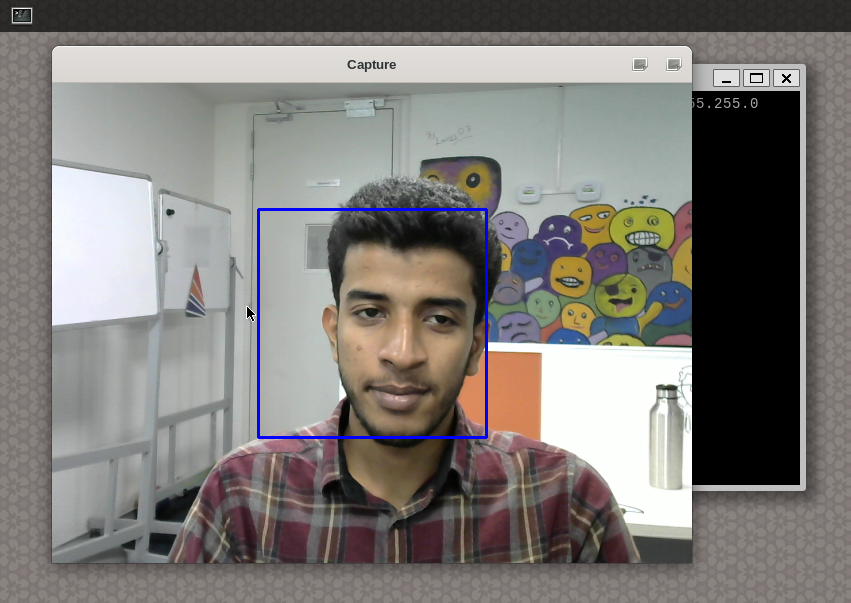

# RZV2L AI Library - Face Recognition & Spoof Detection

## Introduction

The facial biometric system is widely being used for multiple applications. Its popularity is increasing because of its ease of use. One of the problem in this system is, its vulnerability to the spoof attacks. Facial spoof detection is the task of identifying false facial verification by using a photo, video, mask or a different substitute for an authorized person's face.

sample video on YouTube -[Face recognition and spoof detection demo video](https://youtu.be/BOFdP1u-L7k)

## Application details

This whole application is divided into multiple single applications as described below.

### Face Registration

A tool to create face register database integrated with USB camera to capture and save faces.

#### Face Recognition Image

Identifies a person using facial features in an image.

#### Face Recognition Camera

Identifies a person using facial features from camera frames.

#### Face Spoof Detection Image

Classifies the given image to genuine or spoofed.

#### Face Spoof Detection Camera

Classifies the given camera frame to genuine or spoofed.
```
|-- Face_recognition_cam # Face recognition with CORAL camera input
|   |-- Makefile
|   |-- etc
|   |-- exe
|   |   |-- arcface_cam # DRP-AI files of arcface
|   |   `-- face_recognition_cam_app # The executable
|   `-- src
|-- Face_recognition_img # Face recognition with image input
|   |-- Makefile
|   |-- etc
|   |-- exe
|   |   |-- face_recognition_img_app # The executable
|   |   |-- arcface_bmp # DRP-AI files of arcface
|   |   `-- sample.bmp
|   `-- src
|-- Face_recognition_usbcam # Face recognition with USB camera input
|   |-- Makefile
|   |-- etc
|   |-- exe
|   |   |-- arcface_cam # DRP-AI files of arcface
|   |   `-- face_recognition_usbcam_app # The executable
|   `-- src
-- Face_registration_cam # Face registration app with CORAL camera input
|   |-- Makefile
|   |-- etc
|   |-- exe
|   |   |-- arcface_bmp # DRP-AI files of arcface
|   |   `-- face_registration_cam_app # The executable
|   `-- src
|-- Face_registration_usbcam # Face registration app with USB camera input
|   |-- Makefile
|   |-- etc
|   |-- exe
|   |   |-- arcface_bmp # DRP-AI files of arcface
|   |   `-- face_registration_usbcam_app # The executable
|   `-- src
|-- Face_spoof_detection_cam # Face spoof detection on CORAL Camera input
|   |-- Makefile
|   |-- etc
|   |-- exe
|   |   |-- face_spoof_detection_cam_app # The executable
|   |   `-- resnet50_classifier_cam # DRP-AI files of resnet50
|   `-- src
|-- Face_spoof_detection_img # Face spoof detection on image input
|   |-- Makefile
|   |-- etc
|   |-- exe
|   |   |-- face_spoof_detection_img_app # The executable
|   |   |-- resnet50_classifier_bmp # DRP-AI files of resnet50
|   |   `-- sample.bmp
|   `-- src
|-- Face_spoof_detection_usbcam Face spoof detection on USB Camera input
|   |-- Makefile
|   |-- etc
|   |-- exe
|   |   |-- face_spoof_detection_usbcam_app # The executable
|   |   `-- resnet50_classifier_cam # DRP-AI files of resnet50
|   `-- src
|-- README.md
|-- database
    `-- face_features.csv # Sample face feature database
```

### Model details

#### ArcFace

- ArcFace is a CNN based model for face recognition which learns discriminative features of faces and produces embeddings for input face images. To enhance the discriminative power of softmax loss, a novel supervisor signal called additive angular margin (ArcFace) is used here as an additive term in the softmax loss.
- Pretrained model reference - [ArcFace](https://github.com/onnx/models/tree/main/vision/body_analysis/arcface)

#### ResNet-50

- Official paper - [Deep Residual Learning for Image Recognition](https://arxiv.org/pdf/1512.03385.pdf)
- Dataset - [VGGFace2](https://www.robots.ox.ac.uk/~vgg/data/vgg_face2/)
- In this application ResNet-50 is used for extracting facial features.
- Finetuned the model with 2190 images of 73 classes to get 512 feature embeddings.

### Application with image input

- The user has to create multiple embeddings using `Face_registration` app, and will be saved in `database/face_features.csv`.
- The facial features of test image (ie, `sample.bmp`) obtained from ResNet-50 are compared with the embeddings of known people by taking euclidean distance. The identity is considered to be the person whose name corresponds to the shortest distance.
- Outputs the recognized person if the distance is less than a threshold value.

### Application with camera input

- The user has to create multiple embeddings using `Face_registration` app, and will be saved in `database/face_features.csv`.
- The facial features of obtained from camera input are compared with the embeddings of known people by taking euclidean distance. The identity is considered to be the person whose name corresponds to the shortest distance.
- Outputs the recognized person if the distance is less than a threshold value.

## Running the application

Weight files for this application are availbale in [release 1.2.4](https://github.com/Ignitarium-Renesas/RZV2L_AiLibrary/releases/tag/v1.2.4).
Kindly paste the file [arcface_bmp_weight.dat](https://github.com/Ignitarium-Renesas/RZV2L_AiLibrary/releases/download/v1.2.4/arcface_bmp_weight.dat) in below folders 
```
06_Face_recognition_spoof_detection/Face_recognition_img/exe/arcface_bmp/
06_Face_recognition_spoof_detection/Face_registration_usbcam/exe/arcface_bmp/
06_Face_recognition_spoof_detection/Face_registration_cam/exe/arcface_bmp/
```
and [arcface_cam_weight.dat](https://github.com/Ignitarium-Renesas/RZV2L_AiLibrary/releases/download/v1.2.4/arcface_cam_weight.dat) file in below folders.
```
06_Face_recognition_spoof_detection/Face_recognition_cam/exe/arcface_cam/
06_Face_recognition_spoof_detection/Face_recognition_usbcam/exe/arcface_cam/
```

### Building the sample application:

This is an optional step since already compiled application is available in `exe/`.

These steps must be performed in Laptop/PC with the support of RZV2L toolchain.

Please follow the below steps for image application:

```
cd $work_dir
git clone https://github.com/Ignitarium-Renesas/RZV2L_AiLibrary 
cd RZV2L_AiLibrary/06_Face_recognition_spoof_detection/<application>
make
```

### Running the sample applications

#### Face Registration

1. Copy the `RZV2L_AiLibrary` directory to the board (/home/root/).
2. Follow below steps;

```
cd /home/root/RZV2L_AiLibrary 
cd 06_Face_recognition_spoof_detection/Face_registration_<cam/usbcam>/exe/
./face_registration_cam
```
3. Choose whether to capture image, append or write database.
    1. for capturing new face
        1. Enter the name of the image to be saved.
        2. The face must be inside the circular region.
        3. Enter c (c+Enter) to capture.

```
root@smarc-rzv2l:~/RZV2L_AiLibrary/06_Face_recognition_spoof_detection/Face_registration_usbcam/exe# ./face_registration_usbcam_app
Choose any one option from below
[0] for capturing new face
[1] for adding new face to register [Add new values to existing register]
[2] for creating new face register [Erasing previous register]
0
---------------------------
Capturing from Coral Camera
---------------------------

Enter the name of the picture
ipokw
---------------------------
..Enter c (c+Enter) to capture..
---------------------------
c
root@smarc-rzv2l:~/RZV2L_AiLibrary/06_Face_recognition_spoof_detection/Face_registration_usbcam/exe#
```

After above command, a window will appear on the screen.




    2. for creating new face register or for adding new face to register.
        1. Enter the number of samples to be embdded.
        2. Enter person's name and path to his/her image.
        
        

```
root@smarc-rzv2l:~/RZV2L_AiLibrary/06_Face_recognition_spoof_detection/Face_registration_cam/exe# ./face_registration_cam 
Choose any one option from below
[0] for capturing new face
[1] for adding new face to register [Add new values to existing register]
[2] for creating new face register [Erasing previous register]
1
Enter the number of samples to be embedded 
5
Enter the person name 
Chris
Enter the image path 
/home/root/06_Face_recognition_spoof_detection/Face_registration_cam/exe/captures/Chris.bmp
Loading : arcface_bmp/drp_desc.bin
Loading : arcface_bmp/resnet50_bmp_drpcfg.mem
Loading : arcface_bmp/drp_param.bin
Loading : arcface_bmp/aimac_desc.bin
Loading : arcface_bmp/resnet50_bmp_weight.dat
Inference -----------------------------------------------
[START] DRP-AI
[END] DRP-AI
Input: /home/root/06_Face_recognition_spoof_detection/Face_registration_cam/exe/captures/Chris.bmp
```

6. The face embedding database - `database/face_features.csv` would get updated.

#### Face Recognition Image

1. Copy the `RZV2L_AiLibrary` directory to the board (/home/root/).
2. Follow below steps;

```
cd /home/root/RZV2L_AiLibrary 
cd 06_Face_recognition_spoof_detection/Face_recognition_img/exe/
```
3. Copy test image (`sample.bmp`) to `06_Face_recognition_spoof_detection/Face_recognition_img/exe/`.
4. Run the executable.
```
root@smarc-rzv2l:~/RZV2L_AiLibrary/06_Face_recognition_spoof_detection/Face_recognition_img/exe# ./face_recognition_img_app
RZ/V2L DRP-AI Sample Application
Model : ArcFace    | arcface_bmp
Input : Windows Bitmap v3 | sample.bmp
Loading : arcface_bmp/drp_desc.bin
Loading : arcface_bmp/arcface_bmp_drpcfg.mem
Loading : arcface_bmp/drp_param.bin
Loading : arcface_bmp/aimac_desc.bin
Loading : arcface_bmp/arcface_bmp_weight.dat
Inference -----------------------------------------------
[START] DRP-AI
[END] DRP-AI
Input: sample.bmp

Recognized person is Paul
```

#### Face Recognition Camera

1. Copy the `RZV2L_AiLibrary` directory to the board (/home/root/).
2. Follow below steps;

```
cd /home/root/RZV2L_AiLibrary 
cd 06_Face_recognition_spoof_detection/Face_recognition_<cam/webcam>/exe/
```

4. Run the executable. When calibrating the background no faces or moving objects be present in the frame.

```
root@smarc-rzv2l:~/RZV2L_AiLibrary/06_Face_recognition_spoof_detection/Face_recognition_cam/exe# ./face_recognition_cam_app 
RZ/V2L DRP-AI Sample Application
Model : ArcFace    | arcface_cam
Input : USB Camera
Loading : arcface_cam/drp_desc.bin
Loading : arcface_cam/arcface_cam_drpcfg.mem
Loading : arcface_cam/drp_param.bin
Loading : arcface_cam/aimac_desc.bin
Loading : arcface_cam/arcface_cam_weight.dat
[INFO] USB Camera: /dev/video1
Key Hit Thread Starting
************************************************
* Press ENTER key to quit. *
************************************************
Main Loop Starts
Capture Thread Starting
Inference Thread Starting
Inference Loop Starting
Background calibration is in progress...Stay away from the frame...
Background calibration is in progress...Stay away from the frame...
Background calibration is in progress...Stay away from the frame...
Background calibration is in progress...Stay away from the frame...
Background calibration is in progress...Stay away from the frame...
Background calibration is in progress...Stay away from the frame...
Background calibration is in progress...Stay away from the frame...
Background calibration is in progress...Stay away from the frame...
Background calibration is in progress...Stay away from the frame...
Background calibration is in progress...Stay away from the frame...
Background calibration is in progress...Stay away from the frame...
Background calibration is in progress...Stay away from the frame...
Background calibration is in progress...Stay away from the frame...
Background calibration is in progress...Stay away from the frame...
Background calibration is in progress...Stay away from the frame...
Background calibration is in progress...Stay away from the frame...
Background calibration is in progress...Stay away from the frame...
Background calibration is in progress...Stay away from the frame...
Background calibration is in progress...Stay away from the frame...
Background calibration is in progress...Stay away from the frame...
Background calibration is in progress...Stay away from the frame...
Background calibration is in progress...Stay away from the frame...
Background calibration is in progress...Stay away from the frame...
Background calibration is in progress...Stay away from the frame...
Background calibration is in progress...Stay away from the frame...

Background calibration is done

key Detected.
Key Hit Thread Terminated
Main Process Terminated
AI Inference Thread Terminated
Capture Thread Terminated
Application End
```

#### Face Spoof Detection Image

1. Copy the `RZV2L_AiLibrary` directory to the board (/home/root/).
2. Follow below steps;

```
cd /home/root/RZV2L_AiLibrary 
cd 06_Face_recognition_spoof_detection/Face_spoof_detection_img/exe/
```
4. Copy the image to be checked to `Face_spoof_detection_img/exe/sample.bmp`.
5. Run the executable.
```
root@smarc-rzv2l:~RZV2L_AiLibrary/06_Face_recognition_spoof_detection/Face_spoof_detection_img/exe# ./face_spoof_detection_img_app 
RZ/V2L DRP-AI Sample Application
Model : PyTorch ResNet    | resnet50_classifier_bmp
Input : Windows Bitmap v3 | sample.bmp
Loading : resnet50_classifier_bmp/drp_desc.bin
Loading : resnet50_classifier_bmp/resnet50_classifier_bmp_drpcfg.mem
Loading : resnet50_classifier_bmp/drp_param.bin
Loading : resnet50_classifier_bmp/aimac_desc.bin
Loading : resnet50_classifier_bmp/resnet50_classifier_bmp_weight.dat
Inference -----------------------------------------------
[START] DRP-AI
[END] DRP-AI
 
Genuine Face Detected
```

#### Face Spoof Detection Camera

1. Copy the `RZV2L_AiLibrary` directory to the board (/home/root/).
2. Follow below steps;

```
cd /home/root/RZV2L_AiLibrary 
cd 06_Face_recognition_spoof_detection/Face_spoof_detection_<cam/webcam>/exe/
```
4. Run the executable.
```
./face_spoof_detection_cam_app
```

## Limitations

1. Image input size (112x112) is fixed.
2. Background and light conditions are affecting the prediction.
3. Multiple face embeddings of a person may require for better predictions.
4. The face must be aligned in the box showing on the screen.

### Known issues:
1. [ERROR] Image buffer address is NULL : This error suggests that the input path to the image is improper. Verify the path, check whether an image available in the path.
2. Segmentation fault : If you are running the application in image mode, beware of the image dimensions entered. If entered image width or height is larger than the actual image dimensions, then a segmentation fault will occur.
3. Improper output : If you are running the application in image mode, beware of the image dimensions entered. If entered image width or height is smaller than the actual image dimensions, then improper or unexpected outputs will be observed.
4. [ERROR] Failed to initialize USB Camera - This error is observed if camera is not connected to the board. Check camera connection properly. Connect and restart the board.
5. permission denied - This error may occur if executable file does not have execution permission. Use this command - `chmod 777 executable_filename` to assign proper permissions.
6. [ERROR] Failed to open: <prefix>/<prefix>_weight.dat error=2. [ERROR] Failed to load data from memory: <prefix>/<prefix>_weight.dat Failed to load DRP-AI object files - This error suggests that the weight file is not availbale in the `exe` folder. Download the weight file from the release in github and place it properly in the `exe/subfolder`.
7. When capturing a new face, USB camera is not detecting then edit `Face_registration/src/capture_face.cpp` and build new executable.
```
    /* Create a VideoCapture object. Change the constructor argument based on the video feed (/dev/video1 is being captured below) */
    VideoCapture cap(1);
```
